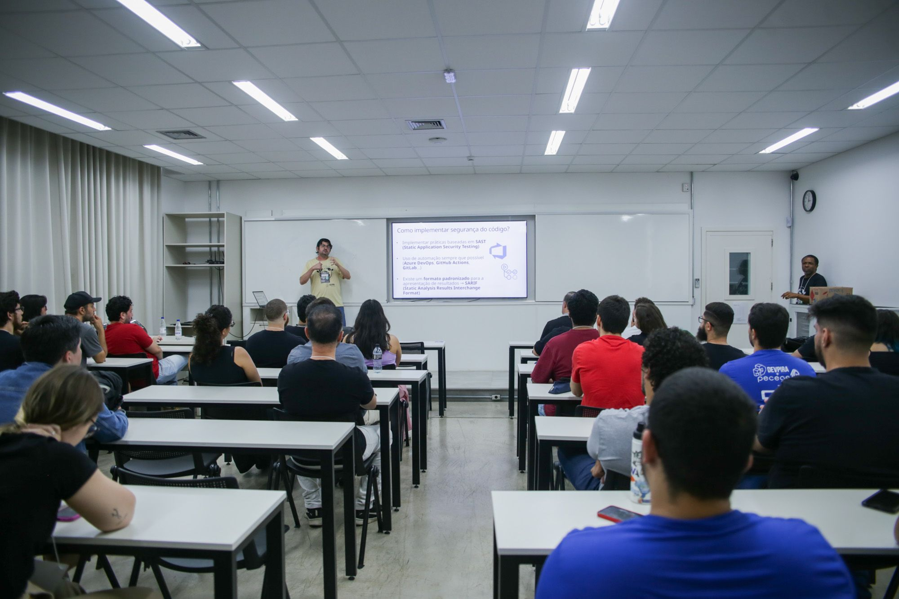
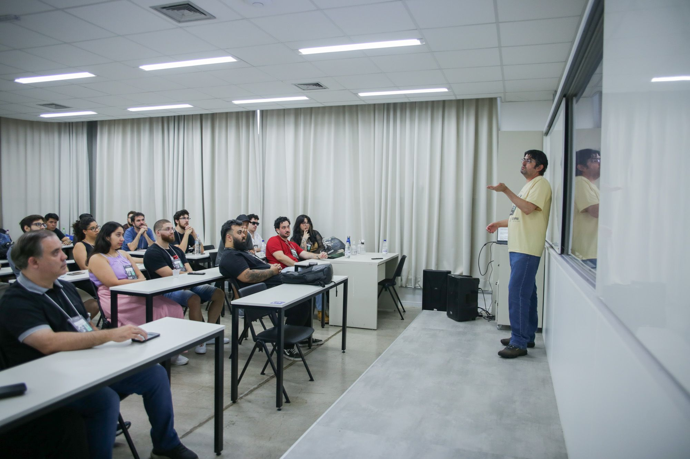
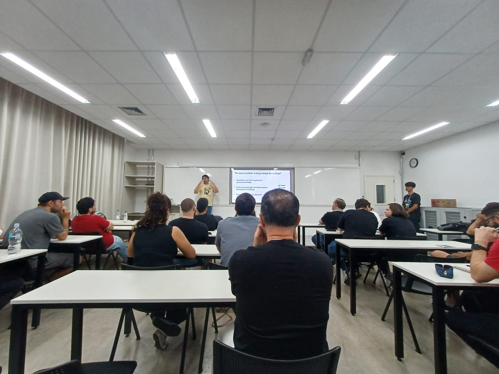
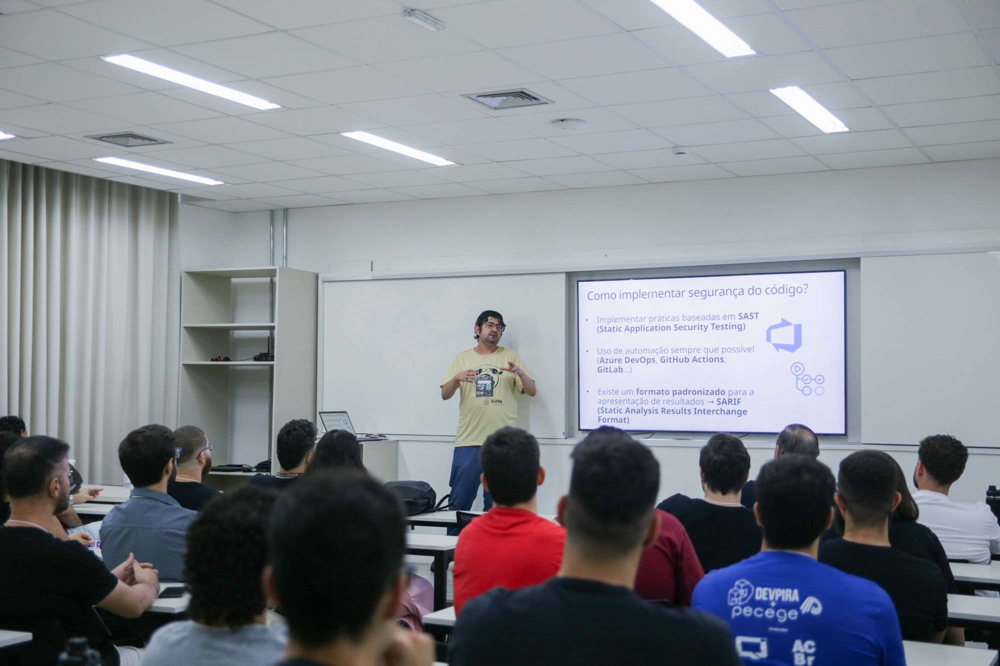
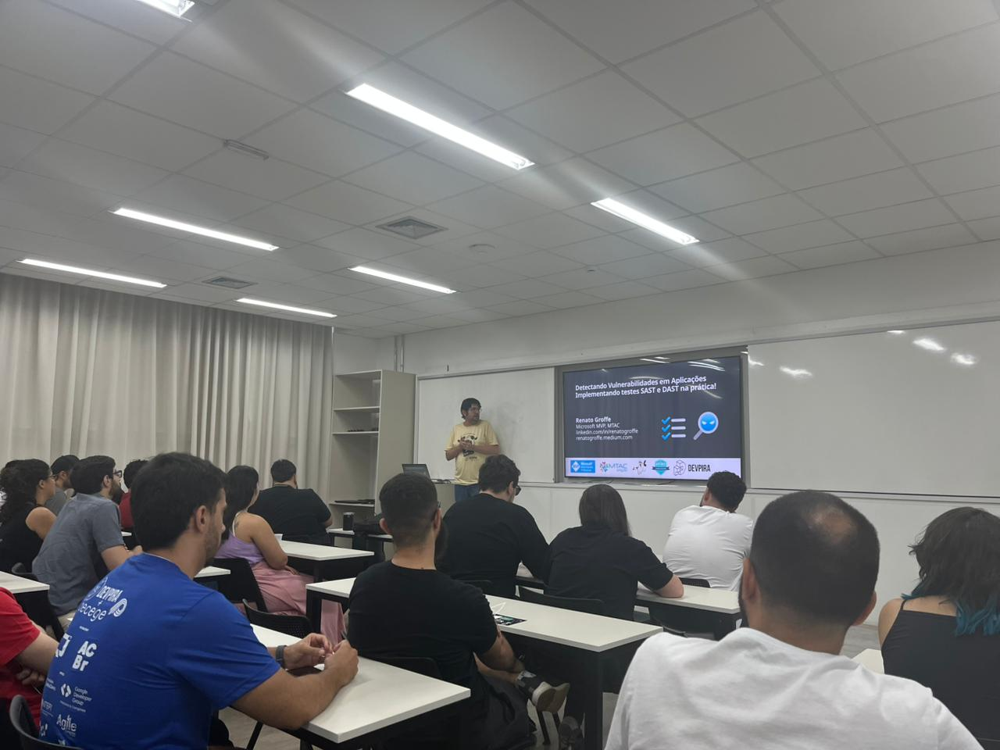
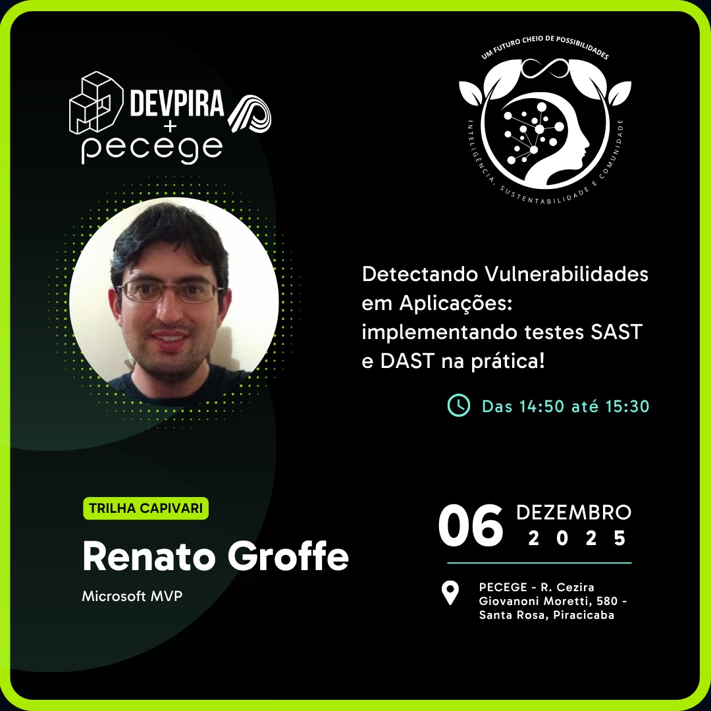
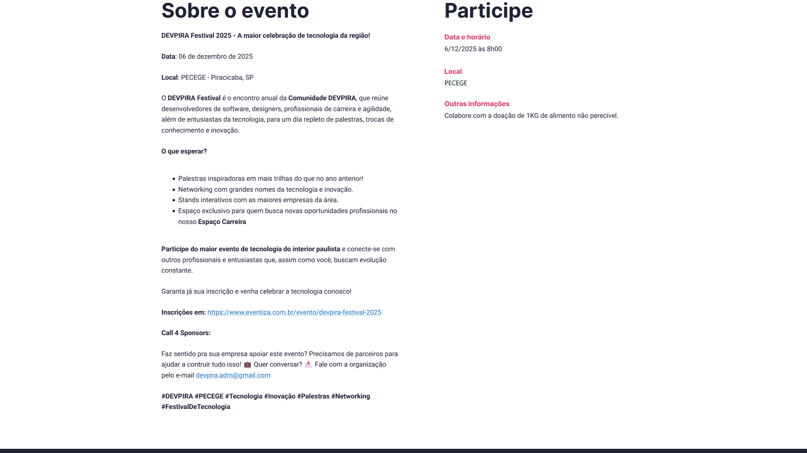
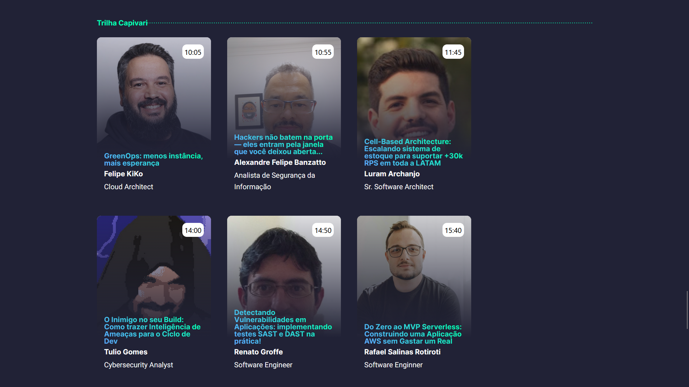

# sast-dast_devpira-festival-2025
Conteúdos sobre SAST (Static Application Security Testing) e DAST (Dynamic Application Security Testing) de apresentação realizada durante a edição 2025 do DEVPIRA Festival.

Exemplos:
- [SAST em uma aplicação .NET containerizada + simulação de deployment em um cluster Kubernetes](https://github.com/renatogroffe/githubactions-sast-dotnet-containers)
- [**Pipeline do Azure DevOps utilizando a ferramenta OWASP Dependency Check para análise de vulnerabilidade em projetos**](https://github.com/renatogroffe/AzureDevOps-OWASPDependencyCheck)
- [**Workflow do GitHub Actions com execução do Docker Scout via CLI**](https://github.com/renatogroffe/GitHubActions-DockerScout-DotNet6)
- [**Pipeline do Azure DevOps com execução do Trivy para analisar vulnerabilidades em uma imagem Docker**](https://github.com/renatogroffe/AzureDevOps-Trivy-kind)
- [**Pipeline do Azure DevOps com execução do gitleaks para detecção de configurações sensíveis em código de aplicações**](https://github.com/renatogroffe/azuredevops-gitleaks-dotnet6)
- [**Pipeline do Azure DevOps com execução do Checkov para análise de arquivos Dockerfile**](https://github.com/renatogroffe/AzureDevOps-Checkov-Dockerfile)
- [**Pipeline do Azure DevOps com execução do KICS para analisar a segurança de um script Terraform que cria um cluster Kubernetes no Azure**](https://github.com/renatogroffe/AzureDevOps-KICS-Terraform-AKS)
- [**Pipeline do Azure DevOps com execução do utilitário Popeye para analisar vulnerabilidades de um cluster Kubernetes (criado com o emulador kind)**](https://github.com/renatogroffe/AzureDevOps-Popeye-Kubernetes-kind)
- [**Pipeline do Azure DevOps com execução do utilitário Kubescape para analisar vulnerabilidades de um cluster Kubernetes (criado com o emulador kind)**](https://github.com/renatogroffe/azuredevops-kubescape-kubernetes-kind)
- [**Pipeline do Azure DevOps analisando vulnerabilidades de um arquivo .apk (Android) de um app mobile baseado em React Native**](https://github.com/renatogroffe/azurepipelines-reactnative-android-build-mobsf)

Segurança de APIs:
- [**APIsec Scanner**](https://cloud.apisecapps.com/)
- [**Certificações Gratuitas em Segurança de APIs - APIsec University**](https://cloud.apisecapps.com/)

---

## Informações sobre o evento

Título da apresentação: **Detectando Vulnerabilidades em Aplicações - Implementando testes SAST e DAST na prática!**

Data: **06/12/2025 (sábado)**

Tecnologias e tópicos abordados: **Containers, Docker, Kubernetes, .NET, ASP.NET Core, Linux, GitHub Actions, Azure DevOp, Docker Scout, Trivy, KICS, Checkov, APIsec Scanner, ZAP, Snyk, Veracode, Checkmarx...**

Número de participantes: **40 pessoas (estimativa)**

O DEVPIRA Festival é um evento presencial promovido pelo pessoal do DEVPIRA, uma das comunidades técnicas mais ativas do interior de São Paulo. A cada são centenas de participantes e dezenas de palestrantes, abordando tecnologias e práticas em alta no mercado de tecnologia.

Site do evento: **https://www.devpira.com.br/eventos/Festival2025**

Local: **PECEGE - Rua Cezira Giovanoni Moretti, 580 - Santa Rosa - Piracicaba-SP - CEP: 13414-157**

Deixo aqui meus agradecimentos ao **Alexandre Ballestero**, ao **Fábio Baldin**, ao **Murilo Beltrame** e demais organizadores por todo o apoio para que eu partipasse como palestrante de mais uma edição do **DEVPIRA Festival**.

---

Todas as fotos podem ser encontradas neste link [link](img/).